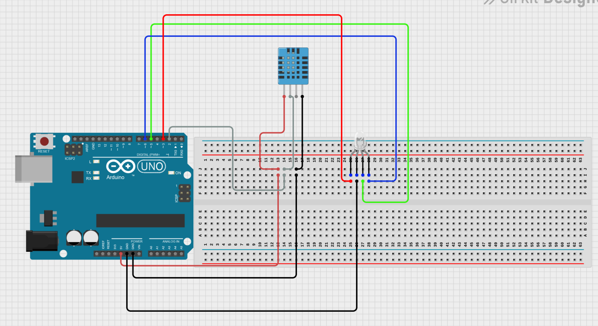
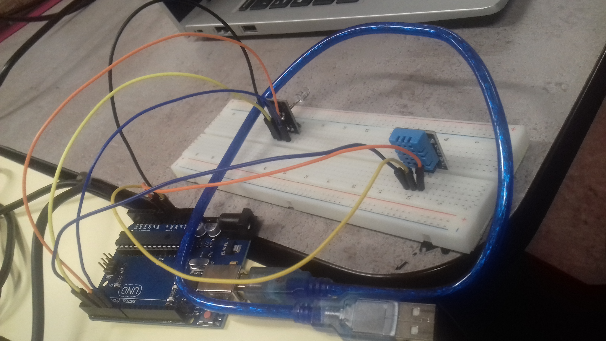

Projet de Gestion de Plantes

Ce projet utilise un capteur de température et d'humidité (DHT) ainsi que des LEDs RGB pour surveiller l'environnement de croissance des plantes. L'objectif principal est de mesurer les conditions environnementales, de les comparer aux conditions idéales pour différentes plantes, et d'afficher les résultats, ainsi de changer la couleur d'une LED RGB en fonction des conditions environnementales approprié pour une plante désignée.

Composants Utilisés

    Capteur DHT (DHT11)
        Mesure la température et l'humidité de l'environnement.

    LEDs RGB (Rouge, Vert, Bleu)
        Utilisées pour afficher une couleur correspondant aux conditions environnementales mesurées.

Structure du Code

Le code est structuré de la manière suivante :

    Initialisation
        Configuration des broches pour les LEDs RGB.
        Définition de la couleur par défaut.

    Boucle Principale (loop)
        Mesure de la température et de l'humidité.
        Obtention des plantes adaptées aux conditions mesurées.
        Affichage des plantes adaptées et non adaptées.
        Recherche des conditions idéales pour une plante spécifique et ajustement de la couleur en conséquence.

    Fonctions Utilitaires
        mesurerEnvironnement: Mesure la température et l'humidité.
        recupererConditionsIdeales: Récupère les conditions idéales pour une plante donnée.
        ajouterPlanteAdaptee: Ajoute une plante adaptée ou non adaptée à la chaîne correspondante.
        afficherPlantesCorrespondantes: Affiche si une plante correspond aux conditions actuelles.
        conditionPlanteIdeale: Vérifie si les conditions d'une plante sont idéales.
        traiterPlantes: Traite les plantes en fonction du type de traitement spécifié.
        obtenirPlantesAdaptees: Obtient les plantes adaptées aux conditions spécifiées.
        obtenirPlantesCorrespondantes: Obtient les plantes correspondant aux conditions spécifiées.
        definirCouleur: Définit la couleur des LEDs RGB.
        afficherPlantesAdaptees: Affiche les plantes adaptées et non adaptées.

Utilisation

    Connectez le capteur DHT et les LEDs RGB selon le schéma de connexion.
    Téléversez le code sur la carte Arduino.
    Surveillez la sortie série pour les mesures et les résultats.

Remarque

Montage

